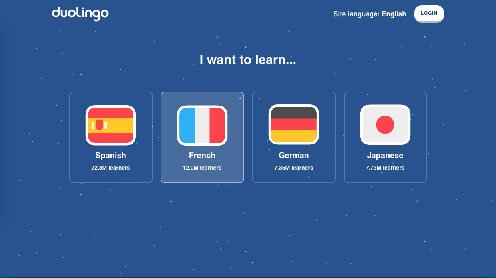
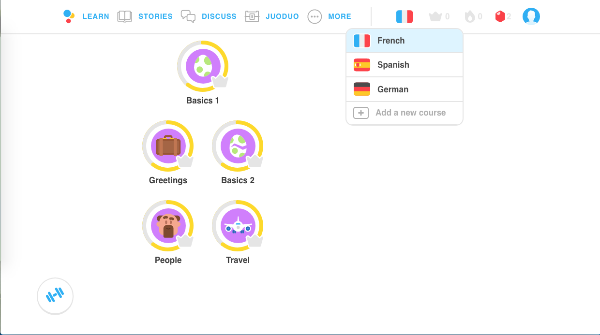
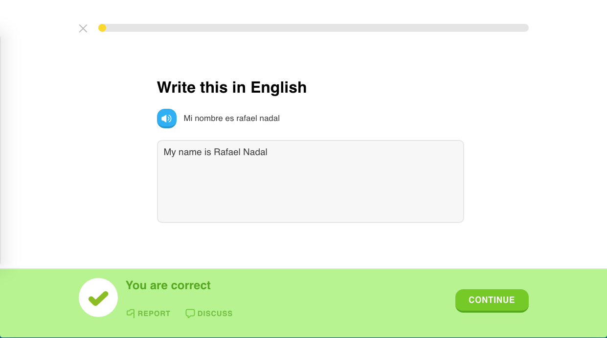
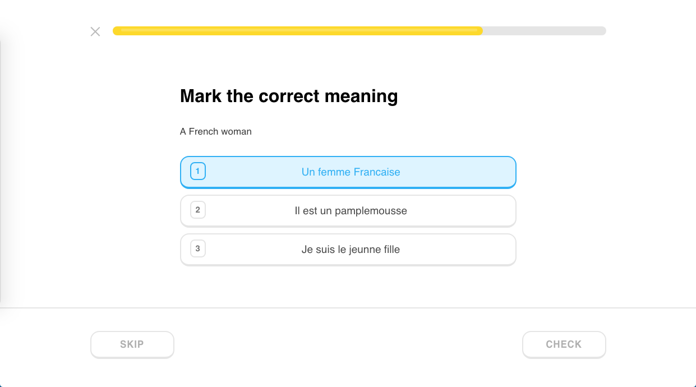
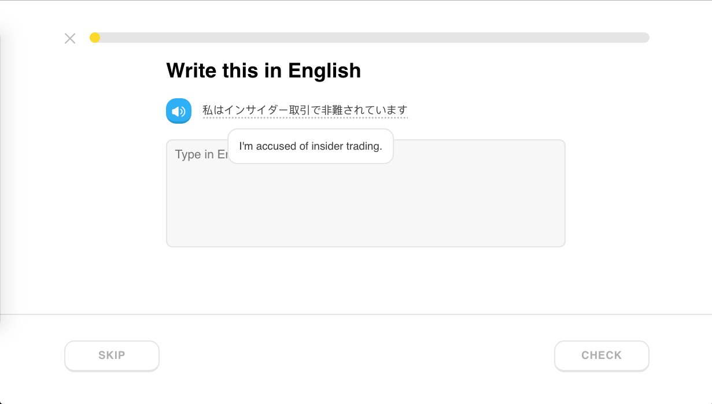
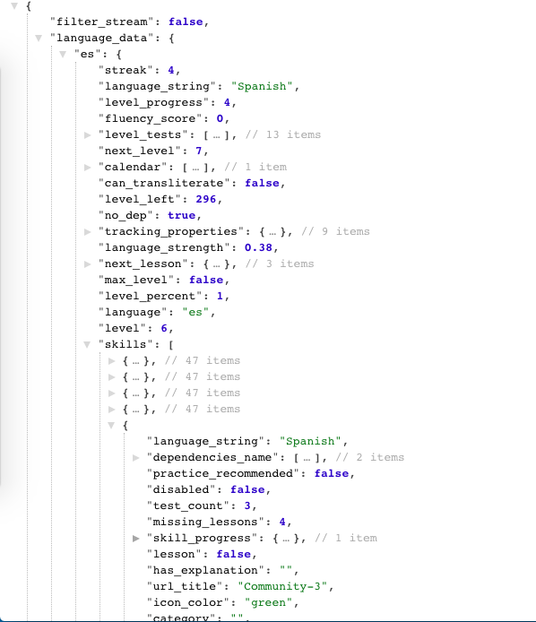

# JuoDuo
livelink: https://duojuo.herokuapp.com/#/

JuoDuo is a fully functional clone of Duolingo, that uses the actual DuoLingo User JSON (and in particular, the LanguageData Object) as an architectural reference [(check out the sample state!)](https://github.com/jdarmoni/DuoJuo/wiki/Sample-State). It was built from the ground up using a Ruby on Rails backend, PostGreSQL database, and a React - Redux frontend. 

# Key Features 

## Auth 

Users can Login, or click Get Started to use the site anonymously. 

Clicking 'Get Started' takes you to the Register component, where you can select a language to immediately begin learning. Later, users are given the option of saving their info & progress into a profile via the CreateProfile modal in the Dashboard - but no presh!

## Register 

Choose up to four (for now) languages. 

## Dashboard 

Each language comes with three lesson modules. Users are able to switch languages or add courses to their profile from the flag dropdown in the nav bar section. 

## Lesson

Complete lessons to gain rupees and increase the yellow progress bar (up top)! There are three (for now) types of lessons: text translations, radio-button-multiple choice, and click-to-construct-a-sentence translations. More to come!

## Need a hint?

Mouse over a word or phrase and the Microsoft API will offer you a translated hint!

## State Shape

Features a state shape that mirrors Duolingo's own production JSON!

## Upcoming & Bonus

Using grammarGraph for automated sentence construciton, allowing endless practice content

Integration with Juolingo

